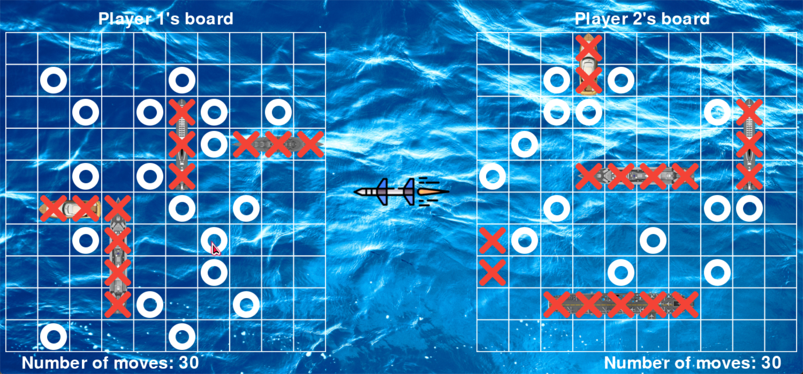

# Battleship GUI

Battleship game made completly with python using pygame

# Requirements

- Pygame
- libmpg123-0.dll (in `C:\Windows\System32` and `C:\Windows\SysWOW64` to allow pygame to play mp3 files)

# Code

- Main menu: `main.py`
- Playing phase: `play.py`
- Bot brains: `bot.py`
    - Bot algorithm inspired by the probability density function algorithm from [here.](https://www.datagenetics.com/blog/december32011/)

